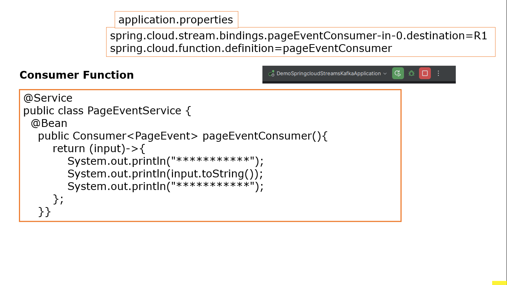

<h3>Activité Pratique N° 1 : Event Driven Architecture</h3>

<h4>1.</h4>
<h4>- Télécharger Kafka</h4>

<h4>- Démarrer Zookeeper</h4>

<h4>- Démarrer Kafka-server</h4>

<h4>- Tester avec Kafka-console-producer et kafka-console-consumer</h4>

<h4>
- 3. En Utilisant KAFKA et Stpring Cloud Streams, Créer :
</h4>

<h4>- Un Service Producer KAFKA via un Rest Controler</h4>

<h4>- Un Service Consumer KAFKA</h4>

<h4>- Un Service de Data Analytics Real Time Stream Processing avec Kaflka Streams</h4>
<h4>- Une application Web qui permet d'afficher les résultats du Stream Data Analytics en temps réel</h4>

